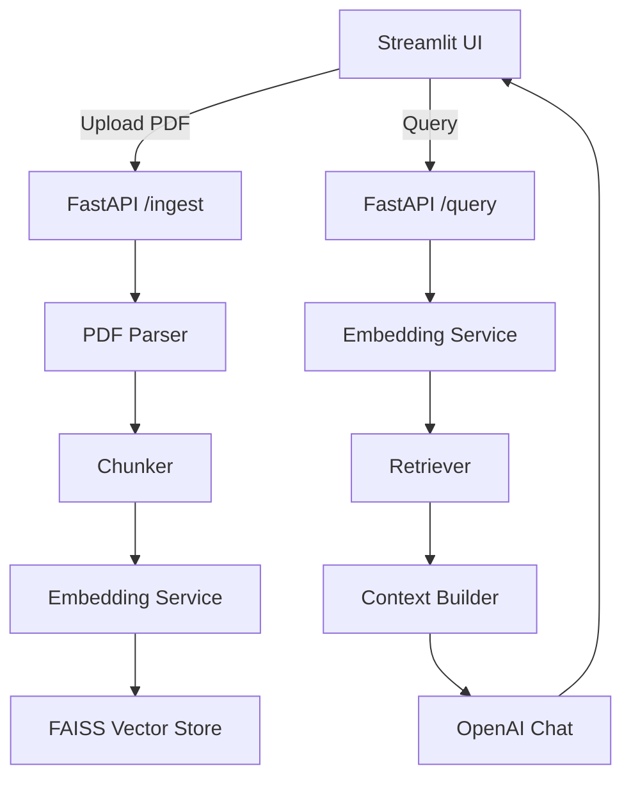

# Architecture



## Prompt template

```
System: Answer strictly from provided context; if unknown, say you don't know; cite sources by filename and chunk id; be concise.
User: Query: {query}

Context:
{context_blocks}
```

If the context does not contain information that answers the query, the assistant must
reply: "I don't know." and avoid speculation.

## Components

- **API layer:** FastAPI application exposing `/health`, `/ingest`, and `/query` endpoints.
- **PDF parsing:** pypdf with pdfminer fallback to maximize extraction success.
- **Chunking:** Sentence-aware splits with overlap to preserve semantics.
- **Embeddings:** Deduped, cached OpenAI embeddings with batching and cost guard.
- **Vector store:** Local FAISS index persisted to disk with metadata.
- **Retrieval:** Top-k vector search (default 3) with optional redaction.
- **LLM:** OpenAI chat completions using `gpt-4o-mini` and conservative token limits.
- **UI:** Streamlit front-end for ingestion and chat.

## AWS lift-and-shift considerations

- Containerize API/UI for ECS or App Runner deployments.
- Replace local FAISS with OpenSearch Serverless or Aurora pgvector.
- Persist PDF text, embeddings, and metadata in S3 or managed databases.
- Migrate secrets to AWS Secrets Manager with rotation.
- Integrate CloudWatch Logs and X-Ray for observability.

---

### Value & Next steps

1. Add authentication and role-based access control.
2. Enable audit logging and retention policies.
3. Evaluate Amazon Bedrock models as alternatives.
4. Integrate with policy management/PC systems.
5. Expand guardrails (content filters, compliance checks).
